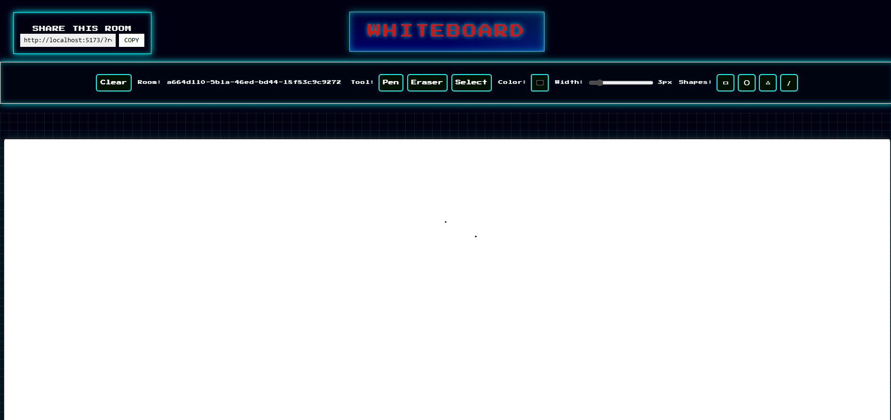
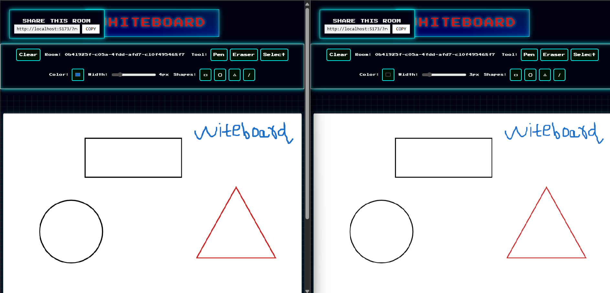

# Collaborative Whiteboard Application

A real-time collaborative whiteboard application built with React and FastAPI, allowing multiple users to draw and interact on a shared canvas simultaneously.




The application features a modern, retro-styled interface with:
- Room sharing functionality
- Drawing tools including pen, eraser, and shape tools
- Real-time collaboration capabilities
- Customizable canvas settings

## Features

- ✏️ **Drawing Tools**
  - Pen tool for freehand drawing
  - Eraser for removing content
  - Shape tools (Rectangle, Circle, Triangle, Line)
  - Selection tool for moving objects
  - Color picker and brush size adjustment

- 🤝 **Real-time Collaboration**
  - Multiple users can draw simultaneously
  - Changes sync instantly across all connected users
  - Room-based collaboration system
  - Shareable room URLs

- 🎨 **Canvas Features**
  - Clear canvas option
  - Responsive canvas sizing
  - Retro-styled UI
  - Error boundary protection

## Technology Stack

### Frontend
- React.js with Vite
- Fabric.js for canvas manipulation
- WebSocket for real-time communication
- Modern CSS with variables and animations

### Backend
- Python FastAPI
- Uvicorn ASGI server
- WebSocket support
- Asyncio for concurrent connections

## Getting Started

### Prerequisites
- Node.js (v18 or higher)
- Python (v3.8 or higher)
- npm or yarn package manager

### Installation

1. **Clone the repository**
   ```bash
   git clone [your-repository-url]
   cd whiteboardgm
   ```

2. **Backend Setup**
   ```bash
   cd server
   pip install -r requirements.txt
   uvicorn main:app --reload --host 0.0.0.0 --port 8000
   ```

3. **Frontend Setup**
   ```bash
   cd client
   npm install
   npm run dev
   ```

The application will be available at:
- Frontend: http://localhost:5173
- Backend: http://localhost:8000

## Environment Configuration

### Frontend (.env)
```
VITE_SERVER_HOST=127.0.0.1:8000
VITE_SERVER_HTTP=http://127.0.0.1:8000
```

### Backend
Configuration via environment variables:
- `ALLOWED_ORIGINS`: Comma-separated list of allowed origins
- `MAX_HISTORY_PER_ROOM`: Maximum number of stored actions per room
- `MAX_ROOMS`: Maximum number of concurrent rooms
- `SHARED_SECRET`: Optional authentication token

## Project Structure

```
whiteboardgm/
├── client/                 # Frontend React application
│   ├── src/
│   │   ├── App.jsx        # Main application component
│   │   ├── Whiteboard.jsx # Canvas and drawing logic
│   │   ├── Toolbar.jsx    # Tools and controls
│   │   └── ...
│   └── package.json
└── server/                # Backend FastAPI server
    ├── main.py           # Server implementation
    └── requirements.txt   # Python dependencies
```

## Features Implementation

### Drawing Tools
- Utilizes Fabric.js for canvas manipulation
- Custom tool implementations for shapes and freehand drawing
- Real-time synchronization of drawing actions

### Room Management
- UUID-based room creation
- WebSocket connections per room
- Message history maintenance
- Concurrent connection handling

### Security
- CORS protection
- Content Security Policy
- XSS protection headers
- Optional token-based authentication

## Contributing

1. Fork the repository
2. Create your feature branch (`git checkout -b feature/AmazingFeature`)
3. Commit your changes (`git commit -m 'Add some AmazingFeature'`)
4. Push to the branch (`git push origin feature/AmazingFeature`)
5. Open a Pull Request

## License

This project is licensed under the MIT License - see the LICENSE file for details.

## Acknowledgments

- Fabric.js for canvas manipulation
- FastAPI for the efficient backend
- React and Vite for the modern frontend setup
